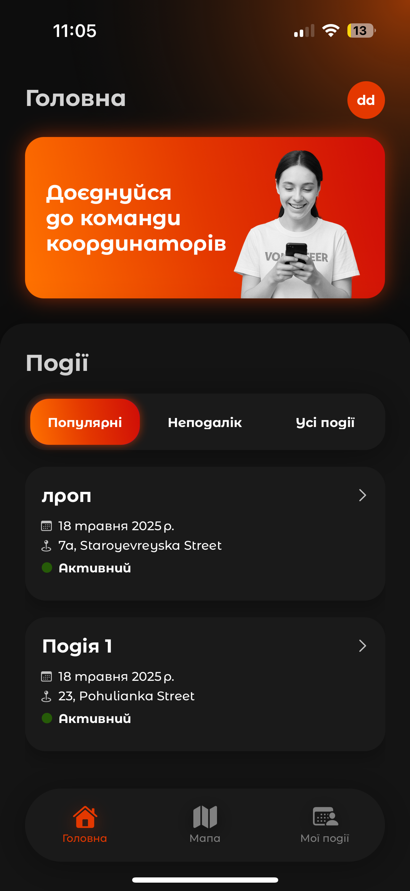

# Poruch Volunteer App

Poruch is a mobile application designed to connect volunteers with community initiatives and local organizations. Built with **React Native** and powered by **Supabase** backend, it enables seamless user authentication, real-time updates, and location-based volunteer matching.

---

## Features

- User registration and authentication  
- Browse and search for volunteer opportunities  
- Real-time updates and notifications  
- Location-based filtering of initiatives  
- Intuitive and responsive UI for mobile devices

---

## Technologies Used

- React Native  
- Supabase (Authentication, Database, Realtime)  
- JavaScript / TypeScript  
- Expo 

  
  
  
  
  
  
  
  
  

